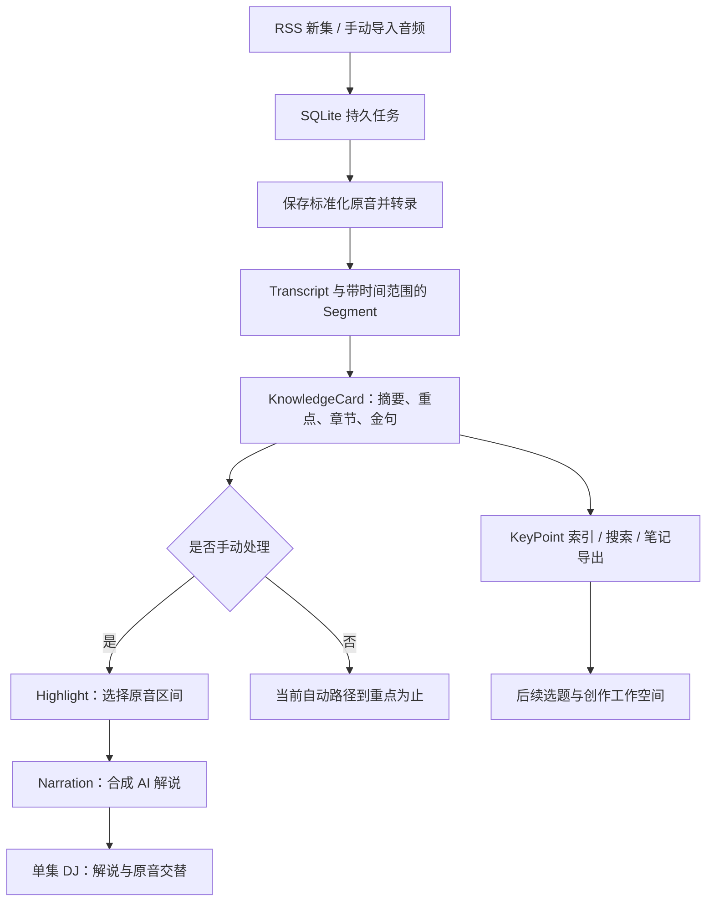

# CloudWisePod：个人播客学习、DJ 精听与文章创作方向

日期：2026-09-12  
状态：用户已确认“学习与创作并重”；具体方案仍为建议，不是实施完成记录。

## 结论

当前项目已经具备个人 Podwise 与单集 DJ 的主要基础：订阅、转录、知识卡片、重点索引、原音引用、AI 解说和高光连播，也有单集精读与跨集文章的实现。下一轮围绕“自动处理新集 → 快速读重点或听精华 → 沉淀知识与个人理解 → 单集精读或跨集文章”形成完整体验；保存的知识同时支持日后检索与回听。

技术上继续使用现有 Go、SQLite 和服务端 HTML。现阶段的关键是接通自动处理路径、提高重点质量、完善播放器，并贯通学习成果到成文的现有路径，尚无依据要求换栈或重建后台。

用户已明确选择“学习与创作并重：听完沉淀知识，也能继续生成文章”。首轮范围同时包含学习和成文验收；已有文章、精读文与创作数据应保留。学习成果可以独立保存，创作也可以从个人想法出发检索已有素材。

竞品事实另见 [Podwise / Snipd 官方资料调研](2026-09-12-podwise-snipd.md)。以下产品方案属于本项目建议，不表示竞品采用相同实现。

## 当前项目如何工作



这是音频路径。项目还支持网页、文本和 PDF 文档 Source，复用学习、引用和创作能力。

- 启动与装配在 [serve.go](../../cmd/cloudwisepod/serve.go)；领域数据、数据库、任务处理、模型适配和页面分别位于 `internal/models`、`store`、`queue`、`provider`、`server`。
- [RSS 刷新](../../internal/rss/refresher.go)支持 `manual`、`all_new`、`filtered`；过滤目前基于标题与描述关键词，开启自动策略主要处理后续新发现的单集。
- [处理流水线](../../internal/queue/worker.go)先保存 EvidenceAudio，再转录、分析、建立索引。模型输出 Segment ID，由程序解析时间范围。
- [KnowledgeCard](../../internal/provider/types.go)包含摘要、要点、章节、金句、标签和建议问题；[引用校验](../../internal/provider/citation.go)核实引用存在及金句逐字匹配。
- [DJ 页面](../../internal/server/templates/dj.html)已经编排 Narration 与原音交替；[Kokoro 适配](../../internal/provider/narration.go)通过外部 CLI 合成，缺失时跳过解说。
- 证据问答、学习对话、复述、收藏、标注、集合、Markdown 导出以及文章创作链路均有代码入口；本轮没有逐项做真实运行验收。

## 与目标的差距

| 目标 | 当前代码事实 | 下一步意义 |
| --- | --- | --- |
| 自动获得重点 | 自动分析并索引 KeyPoint 已实现；自动重点初始为 `needs_review` | 可以先读，但不能把“有引用”直接当成“质量已通过”；个人学习不应被创作审批步骤阻塞 |
| 新集自动可 DJ 精听 | `doAnalyze` 在 `job.Automated=true` 时跳过 Highlight 与 Narration，现有测试明确要求这个行为 | 这是需要主动修订的旧产品规则；增加订阅处理深度，才能让新集自动准备好 DJ |
| 整集重点精炼 | Groq 分窗分析后，`mergeKnowledgeCards` 直接拼接各窗摘要、重点、章节等 | 建议补整集归并、去重和排序；当前实现不能保证最终仍只有少量最关键的观点 |
| 高光听起来连贯 | 提示词要求连续、不重叠、避开广告；校验主要检查引用存在及 Gist 非空 | 连续性、重叠、总时长和上下文完整性需要实际约束与样本评估 |
| 稳定的 DJ 播放 | 页面以墙钟 `setTimeout` 截断原音；提供连播、停止、单段试听 | 应以媒体播放时间管理区间，补暂停恢复、跳段、互斥与失败恢复；缓冲或后台切换时的影响尚未实测 |
| 个人知识召回 | 已有全文搜索与本地向量混合搜索；向量是字符 n-gram 哈希 | 能复用现有检索，但不能据此宣称具备成熟的跨语言、概念级语义检索 |
| 中文解说可日常听 | 已有 TTS 适配与模拟测试 | 真实 CLI 参数、中文音色、停顿和延迟仍需端到端试听确认 |
| 学习到成文 | 已有 EpisodeDigest 与选题、Brief、Writer、审校、发布包入口；真实 Owner 旅程仍待执行 | 首轮验证从一集知识到精读文、从多集素材到个人文章，找出入口与状态衔接的实际断点 |
| 简单的日常入口 | 首页突出内容工作台；导航暴露较多创作与领域对象 | 首页并列“继续学习”和“继续创作”，单集页提供笔记与成文入口，并保留创作中的返回来源能力 |

代码依据：

- 自动路径：[worker.go](../../internal/queue/worker.go) 的 `doAnalyze`；[worker_test.go](../../internal/queue/worker_test.go) 的 `TestPipeline_AutomatedIngestionStopsAfterKeyPoints`。
- 重点初始质量：[keypoints.go](../../internal/store/keypoints.go) 的 `indexCardKeyPoints`。
- 长内容归并：[groq.go](../../internal/provider/groq.go) 的 `mergeKnowledgeCards`；高光请求同文件的 `GenerateHighlights` 仍一次发送全部 Segment。
- 高光规则：[highlight.go](../../internal/provider/highlight.go) 的提示词与 `ValidateHighlightSet`。
- 播放控制：[dj.html](../../internal/server/templates/dj.html) 的 `playEvidence` 与 `runAutoplay`。
- 本地向量：[semantic_search.go](../../internal/store/semantic_search.go) 的 `localTextEmbedding`。
- 首页与导航：[dashboard.html](../../internal/server/templates/dashboard.html)、[layout.html](../../internal/server/templates/layout.html)。

## 建议的核心产品体验

产品承诺可以表述为：**把订阅里的长音频，自动变成能快速读、能精听、能回溯的个人知识，并结合自己的理解继续写成文章。**

用户打开一集，默认能做四件事：

1. **读重点**：一句话概括、少量核心观点、章节；每个观点说明内容和依据，能定位原文。数字、方法、案例与争议在来源确实包含时提取，不为凑字段生成内容。
2. **听精华**：AI 交代必要背景，再播放真正支持观点的原音；可以继续听完整上下文，也可以跳过。AI 解说与原音保持可辨认。
3. **留下知识**：收藏重点、写自己的理解、按主题整理、导出到个人笔记库。来源观点与个人判断分开保存。
4. **继续创作**：围绕本集生成精读文，或把有价值的素材带入跨集选题与文章写作；编辑时能返回相关笔记和原音。

### 两条成文路径

| 路径 | 用户目的 | 复用现有能力 | 首轮体验要求 |
| --- | --- | --- | --- |
| 单集精读 | 把这一集整理成便于阅读、保存或分享的文章 | `EpisodeDigest`：单源转述、带标注的 AI 展开、已有笔记及有依据的补充事实 | 从单集页进入生成、查看、修改或重新生成、导出；正文能够回到来源，个人笔记身份清楚 |
| 个人文章 | 围绕自己的问题或观点，结合多集材料表达判断 | KeyPoint、OwnerReflection、CreationProposal、CreationBrief、Writer、ClaimReview、PublicationPackage | 从素材或个人想法进入选题，确认主张与写作方案，生成及修订文章，完成审校和导出 |

两条路径共享来源、重点和笔记，并保留各自的生成规则。EpisodeDigest 的具体编辑能力需按当前实现核实，不以“已有生成入口”推断具备任意正文编辑。个人文章沿用现有主张与 Brief 确认流程；素材不足时明确显示缺口。自动提取、DJ 准备和已开启的候选发现可在后台执行，文章生成由用户发起或确认写作方案触发，发布由用户决定。

首轮同时验收两条路径的现有实现，优先修复学习成果无法带入创作、引用丢失、笔记身份混淆及生成状态不可恢复等衔接问题。

### 自动提取怎样才算“重点”

建议复用现有 `KnowledgeCard` / `KeyPoint`，先改进生成与筛选，不另建一套同义对象。

- 先按完整 Segment 生成局部候选，再进行整集归并；候选始终携带来源位置。
- 归并保留具体主张、必要语境、支持依据和限制条件；筛除重复、寒暄、广告及空泛标题。
- 区分“来源表达过什么”和“对我为什么有用”。后者属于个人相关性判断，不能改写来源主张。
- 摘要、文字重点和高光各有用途：摘要负责全貌，KeyPoint 负责可复用观点，Highlight 负责值得听的连续原音。它们可以关联，但数量和粒度不必一一对应。
- 程序校验 ID、版本与范围；语义是否支持、有没有漏掉关键限定词，需要独立判定和人工样本评估。有效 ID 不能证明内容忠实。
- 自动检查通过可进入 `ready`；疑点进入 `needs_review`。个人修订与收藏不可被重新分析覆盖。

### DJ 怎样从现有版本升级

首个目标是单集稳定精听：必要的开场、简短串场、原音区间、收尾。以用户选择的时长或详略组织节目；不要预先承诺每集都能以固定压缩比保留全部价值。

增加两个 Module 即可明确职责，无需预先搭建大量层级：

- **DJ 编排 Module**：对外 Interface 接受 Source、学习产物版本和目标时长，返回可持久化的播放清单。内部处理选段、上下文补齐、去重、时长、串场与 TTS；清单绑定准确的 Transcript / Highlight / Narration 版本。
- **播放 Module**：对外 Interface 负责加载、播放、暂停、跳段与恢复；内部处理两类音轨互斥、媒体事件、缓冲、失败和进度。单集 DJ 与未来跨集清单复用同一播放能力。

真实变化点已有模型 Provider 和 TTS Provider，可沿用现有 Interface 与 Adapter。先把行为收口到现有包内；仅在复杂度确实需要时新建包。

跨集“今日 DJ”放在单集体验之后：从未听内容中按兴趣、信息增量、重复度和时间预算筛选，记录已听与跳过反馈。它需要持续听播状态与跨集编排，不能只给现有 DJ 页换标题。

## 建议实施顺序

| 阶段 | 改动范围 | 完成条件 |
| --- | --- | --- |
| 1. 共用的自动素材基础 | 订阅处理深度、任务状态与费用记录；整集重点归并、去重、高光校验和质量状态。修订自动任务跳过高光的规则及对应测试 | 新集自动形成可读、可回听、可用于创作的素材；疑点可见，重复刷新不重复排队，失败能恢复 |
| 2. 单集学习与精读成文 | 单集页衔接重点、原音、笔记与 EpisodeDigest；复用当前生成、来源校验、版本和导出实现，按真实旅程补缺口 | 一集处理完成后，用户能理解重点、保存自己的笔记、继续生成精读文并导出；来源与个人理解可区分 |
| 3. DJ 日常可用 | 编排、TTS、`dj.html` 与播放逻辑：音轨互斥、媒体时间截断、暂停恢复、跳段、回到完整节目、进度保存 | 手机浏览器中完成连续精听；弱网、暂停、跳段与重新打开后状态正确；解说缺失仍能听原音 |
| 4. 跨集个人文章 | 贯通已存重点与个人理解、自动候选或定向构思、主张与 Brief 确认、Writer、审校和发布包；验证历史作品去重 | 至少两集素材支持一篇个人文章；写作不丢个人判断与来源关系，缺口可见，修订后能审校并导出 |
| 5. 学习与创作的日常界面 | 首页并列学习与创作的继续入口；单集、笔记、素材、精读文和文章之间可相互定位 | 能继续听、继续整理笔记或继续写作，文章编辑中能返回证据；个人学习无需先配置创作画像 |
| 6. 个性化与扩展 | 兴趣设置、已听反馈、跨集 DJ；按实际需求增加翻译、思维导图或更强语义检索 | 多集选材能解释推荐原因、减少已听与重复观点，符合个人时间预算，并能沉淀为后续创作素材 |

这些阶段表达依赖和顺序，不代表工期承诺。阶段 1–5 属于首轮学习与创作闭环，阶段 6 是后续扩展。阶段 1 中自动生成 DJ 是用户可选择的处理策略，不应静默扩大已有订阅的模型调用量。沿用现有预算与可见费用机制，同时核实学习、高光、TTS、精读文和文章各阶段实际记账，不能仅靠创作预算页面推断已覆盖。

## 首轮验收场景

选择真实的中文长访谈、英文信息密集节目和广告较多的一集，执行：

1. 订阅开启自动提取与 DJ，模拟发现新集；无需逐集点击处理。
2. 查看摘要与重点，人工核对是否抓住主线、保留重要限定条件，并能回听支持它的原音。
3. 完整听一轮 DJ，检查串场是否有帮助、原音是否截断观点、是否重复和是否混入广告。
4. 暂停、跳段、弱网恢复、关页重开；检查播放位置与音轨切换。
5. 收藏一个重点并写个人理解，重新分析后验证人工内容仍在；导出后能回到对应来源。
6. 从该集生成一篇精读文，检查重点与笔记是否合理利用、正文能否回到来源，以及预览、调整与导出的实际能力。
7. 选择至少两集素材，从个人问题或系统候选出发，确认主张与 Brief，生成、修订、审校并导出一篇个人文章；验证素材不足与历史重复提醒。
8. 在文章处理中返回原音和个人笔记，检查引用与身份保留；记录各阶段处理时长、调用费用、知识有用性和文章可用性，再决定是否进入个性化扩展。

先记录真实基线，再确定量化阈值；不把“返回了 JSON”或“测试通过”当成重点提取效果达标。

## 本轮验证与限制

本文件随后根据用户确认的“学习与创作并重”修订定位、实施顺序及验收场景；修订只涉及文档，以下测试证据继承自同日上一轮代码理解，不是对新增成文验收场景的验证。

本轮阅读了产品目标、路线图、相关 ADR、音频流水线、重点索引、模型提示与校验、TTS 适配、DJ 页面、入口页面及相关测试。当前工作区已有未提交的 EpisodeDigest 等改动，已作为现状读取；没有覆盖或修改这些源码。

2026-09-12 对当前工作区执行以下定向测试，5 个包均通过，显式使用 `-count=1`：

```sh
go test ./internal/provider ./internal/queue ./internal/rss ./internal/store ./internal/server -run 'Test(ValidateCard|ValidateHighlightSet|StableHighlightID|ResolveCitation|GroqAnalyze|Groq_Analyze|OpenAI_Analyze|Pipeline_|Automated|Ingestion|RefreshAll_|DoNarration_|DJ|IndexKeyPoints|KeyPointQuality)' -count=1
```

结果支持被选中测试覆盖的引用校验、分析流水线、自动摄取、高光身份、解说容错、DJ 页面渲染和重点索引行为。它不是全部功能测试，也没有执行浏览器音频播放、真实模型调用、真实 Kokoro 中文合成、线上部署或端到端体验验收。

历史文档 [学习与创作旅程](../v1-learning-creation-journey-run.md)也注明真实 Owner 旅程待执行；[EvalSet](../evalset.md)的人工有用性评分仍未填写。这些是继承的状态记录，不是本轮验证结果。
