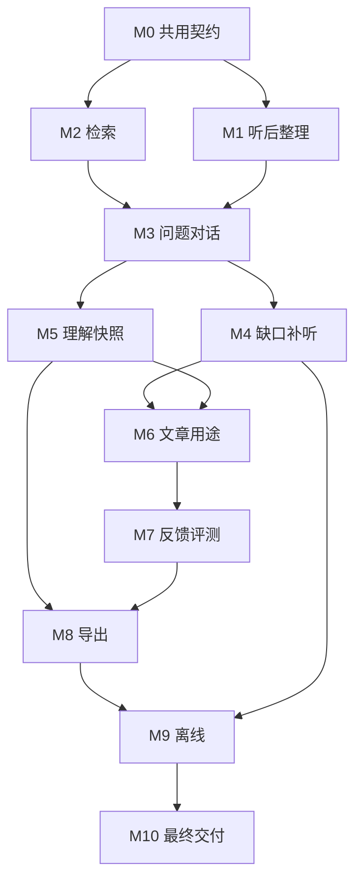

# 第四轮个人听学与知识文章开发计划

日期：2026-10-01。基线：`3024642`，基线迁移截止0069。状态：**已授权实施；实际进度、当前验证和提交见[实施记录](2026-10-01-personal-learning-and-knowledge-articles-v4-validation.md)**。

主设计：[设计文档](../specs/2026-10-01-personal-learning-and-knowledge-articles-v4-design.md)。执行入口：[原子任务清单](2026-10-01-personal-learning-and-knowledge-articles-v4-tasks.md)。继承依据：[第三轮验收](../../acceptance/2026-10-personal-learning-v3.md)。领域词汇中的“第四轮设计术语”只定义计划使用的概念。

剩余任务执行细化：[2026-10-02 剩余 47 项详细工作计划](2026-10-02-personal-learning-v4-remaining-47-work-plan.md)。原编号与完成状态保持不变。

## 1. 交付目标与范围

围绕听后整理、问题对话、材料缺口和文章反馈形成优先使用路径，再补齐理解快照、用途模式、学习成果导出及离线学习。同步优化首页、检索、质量回归、前端表单和付费调用恢复。

| 建议 | 设计位置 | 任务组 | 完成结果 |
| --- | --- | --- | --- |
| 听后一分钟整理 | 设计2.2 | R | 保留实际播放锚点，明确保存唯一个人笔记 |
| 围绕问题跨集对话 | 2.3、6 | C | 冻结问题/材料，后台生成及检查，逐项可追溯 |
| 缺口与补听 | 2.4 | G | 已有缺口变成可检索、可加入原音区间的下一步 |
| 阶段性答案 | 2.5、3 | U | 多来源Owner理解，不可变历史与独立当前选择 |
| 文章用途与计划预览 | 2.6 | W | 四种用途，新契约冻结，默认仍可全自动 |
| 学习成果导出 | 2.8 | E | 可阅读Markdown/ZIP，有界一致性及撤回检查 |
| 手机离线包 | 8 | O | 显式下载、原音离线、草稿同步、期限和清理 |
| 首页下一步 | 2.1 | A05、R05、G05、V02 | 不调用AI的可解释主动作 |
| 语义检索 | 5 | S、U04 | 可选真实embedding+FTS，权限和费用可控 |
| 文章反馈质量回归 | 2.7、10 | F、V02 | 段落反馈成为冻结案例，技术与人工结果分开 |
| 公共表单接口 | 4、7 | A02–A04 | 统一错误/CAS/导航，原表单与根播放兼容 |
| 付费恢复契约 | 6 | A06、S04–S05、C04–C05、C08 | 共用外发/断点/receipt规则，保留业务检查 |

本轮规划覆盖全部建议。O组最后实施，浏览器和手机验收分别记录；设备缺失时完成独立技术交付并明确待验，不能删掉离线任务或用viewport代替手机。

## 2. 基线与已知限制

第三轮全量race、覆盖率、构建和桌面主路径通过，但这些是继承结果。新开发开始时先确认HEAD/工作树与本计划基线的差异。用户修改不覆盖；受影响接口与任务同步修订。

Owner尚无个人笔记，不再重复索取已有资料。使用至少3集自建来源、20条自建笔记、2个问题验证工程；真实个人资料和人工评分保持待验证。真实POD曾给出材料不足；不能在未诊断原因前靠降低材料或归因检查换取成功。

现有真实ASR只测过5.33秒自建合成语音，不能当作手机自然录音通过。M0基线阶段记录当前实体设备条件，不把等待设备算作工程阻断。

## 3. 执行与提交规则

1. 每张任务卡是一项可独立验证/提交的行为，包含必要迁移、失败路径、文档和检查；默认0.5–1.5个专注工程日。超过2天或同时改变两个主要业务行为时继续拆卡。
2. schema/HTTP/JS可分卡，只要未完成入口不默认启用，已交付代码保持原行为，卡的Interface可被直接测试。不把“全功能最后一起可用”作为提交方式。
3. 依赖是最低要求，不代表必须并行。默认单执行者按依赖推进；任务列表不授权自动启用多代理或改写同一文件的并行工作。
4. 先验证当前行为和具体新需求，再做相关检查；迁移、事务、费用、控制、清理及离线同步需要故障/竞争测试。纯文案和简单样式不写镜像实现测试。
5. 每个阶段结束更新实际提交、测试输入/版本/结果与未验证项。创建`v4-validation.md`记录，不能提前填“通过”。每个阶段只在生产代码或新失败改变证据适用性时扩大/重跑门禁。
6. 不调用Owner默认库的测试初始化、迁移、覆盖恢复或清理。不改用户.env；付费接口评测使用显式入口、既有授权范围与预算，真实正文/密钥/音频留在忽略私有目录。
7. 设计变化写入三份文档与相关任务，旧请求/断点契约保留，新增开关缺省关闭。最终提交不等于已部署到真实实例。

## 4. 阶段与退出条件

共11组、73张原子卡，详见任务清单。阶段总工时按功能/集成估算，不等于每卡最大值之和。

| 阶段 | 任务 | 预计工程日 | 退出条件 |
| --- | --- | --- | --- |
| M0 共用契约与基线 | A01–A07 | 3–5 | 固定语料、公共表单、首页投影、study/index/export控制映射及观测基线 |
| M1 留下个人理解 | R01–R06 | 3–5 | 文字/语音听后整理，唯一笔记、问题关系、A/B锚点及恢复通过 |
| M2 检索升级 | S01–S07 | 5–8 | FTS保持兼容，可选索引/查询任务、RRF/降级，权限/费用及目标机性能证据 |
| M3 问题跨集对话 | C01–C09 | 5–8 | 多来源冻结、生成/检查任务、可见依据、草稿采用与旧StudyChat兼容 |
| M4 补听下一步 | G01–G06 | 3–5 | 缺口投影、候选、区间队列、原音播放与失效竞争通过 |
| M5 理解的变化 | U01–U05 | 3–5 | 多来源答案、历史/CAS、权限、问题/来源清理及检索选材正确 |
| M6 用途与写作计划 | W01–W06 | 3–5 | 新提示版本四模式、计划确认、全自动兼容、旧任务不重放 |
| M7 质量反馈闭环 | F01–F06 | 3–5 | 段落反馈、案例接纳、诊断分类、评测副本/报告及私有清理 |
| M8 可携带成果 | E01–E05 | 2–4 | Markdown/ZIP一致性、撤回/鉴权/范围和临时文件清理 |
| M9 离线设备路径 | O01–O11 | 7–11 | 显式下载、离线重开/原音、同步去重/CAS、权限/期限/清理，手机状态如实登记 |
| M10 综合交付 | V01–V05 | 3–5 | 真实升级恢复、完整旅程、最终门禁、文档与阶段提交完整 |
| 合计 | 73卡 | 40–66 | 单执行者估计，约8–13个工作周；设备/Owner评分等待不计入 |

M2语义能力是可选增强：未配置或未通过性能/质量闸门，M3/G仍用FTS工作。技术任务必须交付阻断/降级路径和评测工具；不能用环境未配置掩盖未实现的代码。

## 5. 依赖和推荐顺序



这是推荐交付路径，精确卡依赖见任务列表。S07包含性能/质量闸门，语义默认关闭；C/G不依赖某个真实供应商已配置，只依赖可工作的Retrieve与FTS降级。E功能不依赖离线；O服务器同步命令复用R/笔记/进度的事务行为。

检查点：

- M1结束：拿一段自建原音从继续听到保存理解，确认记录负担与锚点；真实体验意见可以后补。
- M3/M4结束：围绕同一问题比较3来源，指出一项缺口，找真实片段补听；不自动宣称已学会。
- M6/M7结束：同一材料按两种用途生成、按段落反馈形成案例、在副本运行；不把模型审校当Owner评分。
- M8结束：导出包完全离线可读，来源/笔记/通过版身份正确，撤回后不能继续新下载。
- M9结束：真正断网、重开、回网及重复同步；实体手机/HTTPS/后台15分钟有独立记录。

## 6. 迁移与兼容切片

| 变化 | 同卡必须处理 | 当前行为保护 |
| --- | --- | --- |
| 听后整理 | 草稿/唯一保存、笔记关系事务、清理/恢复 | 普通随听笔记与VoiceDraft仍可独立使用 |
| study/index/export | 新类别/方向映射、领取/停止/面板/账本 | 旧任务lane/状态和控制修订不重算 |
| embedding索引 | 版本/维度、权限变化、增量/重建、丢失降级 | 旧FTS与旧字符投影不被当作真实语义模型 |
| 区间队列 | 新区间身份及唯一索引、旧项回填、purge | 已有条目ID/顺序/当前项及DJ计划身份不变 |
| 理解快照 | 无Source答案、聚合权限、索引/选材/清理 | 不放宽OwnerNote的单源Citation/Reference检查 |
| 用途/计划 | 新请求版本、旧提示/估价/断点、计划CAS | 旧文章与最近通过版、旧输入恢复保留 |
| 反馈案例 | 确切段落/哈希、私有正文、案例版本 | 不回写旧正文或暗改Owner偏好 |
| 导出 | 有界快照、当前撤回校验、临时清理 | 现有Markdown及v1/v2实例备份继续可用 |
| 离线 | 会话namespace、撤回epoch、同步UUID、缓存schema | 不缓存登录/设置/任务控制等动态SSR，也不自动重发模型POST |

实际迁移编号从0070起依实施顺序分配，发布后不修改。普通测试可用空库模板，真实0069升级必须全迁移初始化。部署前备份并在副本核对；旧程序回退恢复对应完整备份，新库不能直接由旧程序读取。

## 7. 验证与预算安排

### 7.1 各阶段

按任务卡运行相关store/queue/provider/server行为测试和实际JS控制器测试。迁移覆盖旧行、索引、外键、触发器及断点；事务覆盖CAS/重放/回滚；有外发的阶段覆盖remote-start、response、receipt、控制竞争及未知结果。

浏览器测试实例用独立目录、真实Router/模板/queue和确定性Provider。每次发现问题先保存UI证据，停止浏览器测试实例再修改目标源码，重新启动后复验受影响路径。截图需要实际查看；HTML字符串不能代替真实播放/离线/编辑器动作。

### 7.2 整轮必需门禁

```bash
make test
make cover-gate
make lint
go vet ./...
go build ./cmd/cloudwisepod
git diff --check
```

全部静态JS另做Node语法检查。覆盖率仍为现有95%规则及store78.4%、server79.4%登记地板，不降低或新增豁免；当前server79.4%接近地板，新关键分支需有真实行为覆盖。

### 7.3 真实模型及人工/设备

- 固定自建40条检索查询；跨集对话含3来源、限定条件/反例/无答案。比较FTS和可选embedding的排名/耗时，不以伪向量证明语义效果。
- 真实接口只在显式入口运行，配置/价格/输出能力预检，冻结语料和输入；若新embedding连接未配置，记录具体待验，完成Fake与FTS分支。
- 基于既有POD配置验证新对话与用途；一次回归只运行必要样本，失败前后响应/用量保留，不反复付费重试来制造通过。
- 工程预算取自既有Owner月预算；每次任务冻结估价。没有登记价格且已设预算时先阻断。估算与账单分别记录。
- Owner人工评分、真实笔记积累、实体手机HTTPS及15分钟后台分别登记。没有反馈或设备时工程交付可完成，产品质量/设备结论保持待验证。

## 8. 风险与处理

| 风险 | 处理及验收 |
| --- | --- |
| 语义召回扩大了外发范围 | 权限和确认范围在查询/准入/调用/采用复查，禁止缓存绕过 |
| 个人理解被归成来源事实 | Understanding独立，OwnerReflection只挂Reference，程序检查模型类别 |
| 抽公共执行器改变旧断点 | 先固定行为，不改旧schema/提示身份，以既有已知/未知恢复故障测试验证 |
| 一轮两次调用成本增加 | 生成/校验分阶段冻结预算及receipt，不保证相同模型即独立审校 |
| 片段播放破坏整集进度 | 区间局部游标与Source/DJ进度分开，笔记仍用绝对原音位置 |
| 大索引扫描阻塞SQLite | 查询矩阵在DB事务外运算，有界索引、缓存版本、目标机性能闸门；失败降级FTS |
| 导出/离线复制已撤回内容 | 预览/下载/回网复查状态序列；离线实时撤回有限，24小时期限明确说明 |
| 缓存驱逐或双窗口覆盖草稿 | 文件实际存在/哈希检查、quota错误提示、操作UUID/CAS、保留冲突文本 |
| SW升级切断录音或播放 | 空闲时Owner明确应用更新，缓存版本切换与原根播放独立 |
| 范围膨胀、长时间无法验证 | 73张有界卡、入口默认关闭、阶段退出检查，先交付主路径 |

## 9. 最终交付物与完成定义

1. 七项功能、五项优化的生产实现；新入口/配置/开关明确，旧流程兼容。
2. 当前源码实际门禁结果、迁移/恢复/清理/账本证据。
3. 第四轮使用说明、README、.env.example、当前Go部署/HTTPS/离线隐私、导出与备份说明。
4. 每阶段实际提交和任务完成状态；未完成卡及未验证质量条件分别列出。
5. 真人/实体手机记录若条件具备则实测，否则给明确待验项和可运行入口，不能以“全部通过”盖过限制。

Owner已授权完成本轮全部开发，执行从A01开始。以任务卡和实施记录中的实际提交/验证确定进度，不从文档存在推断代码已完成。
