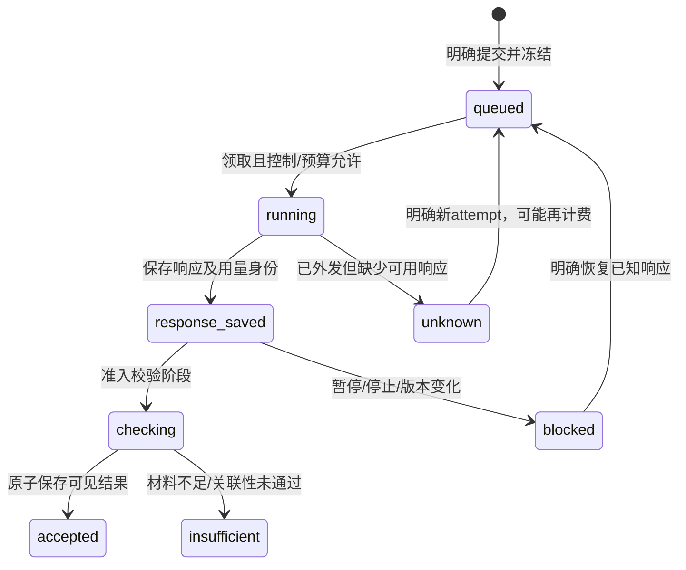

# 第四轮个人听学与知识文章设计

日期：2026-10-01。源码基线：`3024642`。状态：**设计完成，已授权实施；文中表、接口、默认值为目标契约，实际交付见[实施记录](../plans/2026-10-01-personal-learning-and-knowledge-articles-v4-validation.md)**。

关联：[开发计划](../plans/2026-10-01-personal-learning-and-knowledge-articles-v4.md)、[原子任务列表](../plans/2026-10-01-personal-learning-and-knowledge-articles-v4-tasks.md)、[第三轮验收](../../acceptance/2026-10-personal-learning-v3.md)、[领域词汇](../../../CONTEXT.md)。本文覆盖本轮讨论的七项功能和五项实现优化；执行范围以这三份第四轮文档共同定义。

## 1. 目标、基线与范围

### 1.1 产品目标

个人、自托管、单Owner的听学工作空间。日常路径是：继续听 → 留下一点自己的理解 → 围绕问题比较材料 → 看见需要补听的地方 → 生成有依据的文章 → 回顾并更新理解。

第四轮要解决三个具体问题：

1. 已有记录能力，但需要更轻的引导积累个人笔记。
2. 已有问题组织与单来源对话，但缺少围绕问题的跨集比较和补听路径。
3. 已有自动文章与反馈，但需要把反馈转成可复查质量案例，而不只增加生成数量。

### 1.2 已观察到的事实

| 现状 | 依据 | 设计影响 |
| --- | --- | --- |
| 连续播放、队列、问题、增量文章、语音、每日回顾、任务控制已交付 | 第三轮验收及现有源码 | 复用已有身份、CAS、断点与预算，不重做这些流程 |
| 统一检索主要为FTS、中文双字词和小范围别名 | `internal/store/knowledge_search.go` | 新增可选语义召回，与现有结果合并；不称旧字符向量为语义模型 |
| StudyChat读单个来源的Transcript，HTTP内直接生成并校验 | `internal/server/ai_handlers.go` | 新问题对话采用持久任务，旧单来源接口分阶段迁入 |
| OwnerNote必须绑定一个实际Source | `internal/store/owner_notes.go` | 跨来源的理解快照单独建模，不能伪造Source或强塞入单源笔记 |
| 队列唯一身份目前是来源/模式/DJ计划 | `0064_listening_queue.sql` | 补听片段需要新的区间身份；同集不同片段必须同时可入队 |
| 所有控制器由外壳加载，有统一挂载/卸载Scope | `templates/layout.html`、`static/view-lifecycle.js` | 保留根播放器，公共表单行为在该Scope上实现 |
| 新个人任务具备冻结输入、估价、响应断点和receipt | `queue/knowledge_article.go`等 | 扩展现有执行契约，保持未知调用不自动重发 |
| 数据库连接数为1 | `internal/store/store.go` | 事务内只使用同一个tx，不能调用另开DB读取的Store方法 |

第三轮只读盘点为323集、0条个人笔记，Owner确认没有其它笔记。这是继承证据，本次设计未重新盘点默认数据库。真实笔记质量和实体手机验收仍待验证，设计不把自建资料当作真实Owner资料。

### 1.3 功能分层

| 层次 | 内容 | 交付规则 |
| --- | --- | --- |
| 主路径 | 听后整理、问题对话、材料缺口/补听、质量反馈 | 优先完成可实际使用的闭环 |
| 完整能力 | 理解快照、文章用途、学习成果导出 | 纳入本轮计划，独立提交与验收 |
| 设备扩展 | 离线学习包 | 同样列出完整任务；放在最后，先做浏览器契约及设备验收，不承诺所有浏览器后台能力 |
| 实现优化 | 首页下一步、语义检索、质量回归、表单公共接口、付费调用恢复 | 穿插到相应功能阶段，不能只交付按钮 |

现有创作工作台、SSR直接URL、原音/DJ、备份恢复继续工作。此轮不包含多用户、对外自动发布、互联网自动补证、模型微调或原生手机App。服务仍使用Go、SQLite、SSR和原生JS。

## 2. 产品路径与页面

### 2.1 首页“下一步”

保留已有首页，主区显示四类动作：继续收听、整理最近收听、今日到期回顾、处理当前问题/文章。最多显示3条主动作，优先级规则可解释：未完成明确会话 → 今日到期 → Owner选定问题 → 最近收听；不通过模型猜测掌握程度。

Owner可选择当前学习问题。已有来源、任务、每日回顾查询复用元数据投影；GET不新建会话、不生成推荐、不调用模型。没有笔记时直接提供“留一句自己的理解”，不强制完成三项问答。无待办时显示选择节目/问题入口。

桌面保留完整导航；手机主导航突出首页、资料、问题、文章，其它入口可展开。根播放器始终独立于页面，收听、录音及笔记按钮保留。改变导航不破坏旧URL。

### 2.2 听后一分钟整理

三个可选输入：我记住了什么、我哪里没懂、我准备怎样用。至少一个非空即可保存。Owner主动打开；可选“自然结束时轻提示”默认关闭。循环到区间终点、睡眠暂停、切换音轨、加载失败不算听完；提示不抢焦点、不打断自动连播、不自动创建记录。

开始时冻结实际播放来源、快照、原音位置、模式、DJ计划和音频身份。浏览中的来源B不会替代播放来源A。选定学习问题时冻结问题修订；保存过程中该问题已变更则冲突并保留输入。

确认保存生成**一条**OwnerReflection笔记，按非空输入确定性组合正文，三项结构保存在整理元数据中。笔记、问题关系与整理结果在一个事务提交；重复请求返回原笔记。取消、看提示、录音转写和自动保存草稿均不生成正式笔记。

录音复用VoiceNoteDraft及ASR流程。明确采用转写后可放入所选输入栏，再统一保存；已有语音草稿先标记为用于该整理，不走第二条自动笔记保存路径。网络失败保留本地/服务器草稿，原锚点不随后续播放改变。

### 2.3 问题学习对话

从学习问题详情进入，支持“解释概念、比较观点、检查我的理解”三种提问方式。只使用该问题的已确认关系；未确认建议只能供Owner选择，不能静默成为外发材料。问题没有材料时给出关联材料入口。

一轮请求显式选择“使用当前已确认材料”或在其内缩小范围，冻结当时的问题、材料与已接受对话历史。新关联只影响下一轮；旧对话保留旧版本并提示变化。

结果按来源表达、Owner理解、AI解释区分。跨集共识/分歧必须附真实材料定位；依据只能证明来源表达过什么，不能自动证明世界事实。返回“现有材料不足以回答”是合法结果。模型输出的每个引用由程序解析验证，禁止拼出不存在的来源或片段。

生成和关联性校验各自作为持久阶段，页面轮询只读任务。关闭页面后任务继续；已知响应恢复不再次调用；远端结果未知需要明确重试。Owner可停止生成或暂停整个问题对话方向，费用事实继续保留。

把回答加入笔记/理解快照是独立明确操作：先打开可编辑草稿，Owner核对和确认；模型对话不自动成为Owner判断。原单来源StudyChat暂保留原HTTP地址和读取方式，迁移后POST返回可轮询任务身份，由现有JS适配。旧会话历史不重新生成、不伪造新冻结输入。

### 2.4 缺口与补听

复用TopicCandidate.Missing、更新提案Missing和选材覆盖记录。EvidenceGap区分：例子、反例、限定条件、比较依据、实践依据及其它。程序检查与模型建议分别标明来历；模型建议不显示为客观诊断。

“找已有材料”明确运行本地检索，不调用生成模型。每个候选显示真实来源、片段/文档段落、匹配原因及是否已关联；页面最多20项。提示检索范围和遗漏：只检验本次候选，不能说整个库不存在材料。

选中音频结果形成LearningExcerpt，默认窗口为命中真实Segments的起止，允许Owner扩展到相邻真实Segments；不由模型编造时间。文档结果提供阅读定位，不能加入音频队列。未处理节目只显示“需要先处理”，不会自动转录或入付费队列。

“加入补听”扩展既有队列原音条目。区间身份包含Source、snapshot、audioSHA和区间指纹；同集不同区间可以并存，重复同区间幂等。播放开始定位区间起点，末尾保持暂停或按已有显式连播偏好继续；不能将区间结束伪装为整集结束。DJ计划身份与整集续听进度继续独立。

听过片段不自动关闭缺口。Owner可标记有帮助/仍不足/暂不处理；正式确认材料关联后，文章或问题使用现有版本变化机制。来源删除、音频替换、快照失效使片段不可播放，保留明确原因。

### 2.5 理解快照

在问题页保存“我目前的回答、仍不确定什么、下一步”。至少回答非空。正文属于Owner个人理解，不具有Citation身份；可关联多份来源/笔记/文章的确切版本作为Reference。

UnderstandingSnapshot采用独立记录，因为已有OwnerNote只能绑定单Source。可从既有笔记或对话复制到编辑器，最终由Owner确认；不会自动生成重复笔记。问题没有来源时也可以记录自己的想法，但参考关系为空且不得伪造来源。

快照正文不可变，每次保存新版本。问题有单独的理解头版本，采用CAS，避免保存答案与修改问题无关字段过度竞争；冻结的问题修订仍供核对。默认展示Owner选定当前快照以及历史差异，状态是Owner确认的“当前理解”，不是正确率或掌握度。

参考笔记更新、文章新修订或原依据撤回时提示历史版本。普通更新保留冻结依据；来源彻底删除按现有隐私清理语义删除相关冻结正文/参考投影，Owner自己的答案保留，显示“原参考已清理”，不制造可回听链接。删除问题时清理其快照及派生索引；费用账本仍保留。

### 2.6 文章用途

内置四种WritingMode：默认综合、知识解释、观点对比、实践指南。先使用代码中的版本化用途目录和现有偏好，不建设可编程模板市场。

| 用途 | 结构重点 | 独有审校要求 |
| --- | --- | --- |
| 默认综合 | 延续当前结构 | 兼容旧任务与既有偏好 |
| 知识解释 | 问题、概念、例子、边界 | 专名/例子不能无依据补成事实；缺例子时明确不足 |
| 观点对比 | 各方表达、共识、分歧、适用条件 | 不把不同条件下的观点强行判成矛盾 |
| 实践指南 | 适用场景、可执行步骤、限制、检查方式 | 资料建议与Owner实践经验区分，不编造亲身经历或效果 |

用途ID、目录版本、结构要求和评判要求在发现、写作、修订、审校各阶段冻结。用途改变创建新输入，不改旧提示/旧审校哈希。已生成文章后切用途需要显式修订，同文章保留旧通过版。

可选“先预览写作计划”：利用选材阶段已有方向/结构，生成可编辑计划后暂停，Owner确认再写。默认仍走现有自动流程，不新增必经审批。计划正文/材料/用途改变形成新计划修订和新估价；确认同版本幂等，旧计划确认冲突。自动任务不得停留在等待Owner的预览模式，除非该自动偏好明确选择此行为。

### 2.7 文章反馈案例

延续“有用、太浅、重复、归因不准”，增加选择具体段落、问题说明、期望及可选参考。冻结文章ID/修订/段落ID/正文哈希、材料身份和生成配置；旧正文无稳定段落ID时采用该修订中的段落位置与文本哈希，不回写旧正文。

反馈默认只是私有Owner记录。Owner明确“加入质量案例”才形成ArticleFeedbackCase，状态draft/accepted/retired；修改期望产生新版本。案例不能自动改变写作偏好或提示。整篇“有用”无需伪造错误段落。

提供诊断分类：材料薄弱、检索漏召回、外发容量遗漏、结构/提示问题、审校漏检、尚未分类。程序分类必须有已记录的检索/选材事实支持，主观分类由Owner确认；本轮诊断不增加模型调用。真实模型只用于下述明确触发的质量回归。

质量回归分两层：正常测试用自建确定性夹具验证结构和身份；显式评测使用冻结案例与真实模型，记录确切模型、提示、输入、输出、receipt、耗时和人工评分。新提示先在副本中评测，不能用评测运行悄悄替换生产默认配置。

### 2.8 学习成果导出

Owner选择问题或Theme、当前成果/包含历史、是否包含原文摘录。导出为ZIP中的UTF-8 Markdown目录及机器可读manifest；不包含数据库、密钥、Cookie、任务原始配置或私人录音。

```text
learning-bundle/
  index.md
  questions/<stable-id>.md
  understandings/<stable-id>-v<n>.md
  notes/<stable-id>-v<n>.md
  articles/<stable-id>-v<n>.md
  sources/<stable-id>.md
  manifest.json
```

文件名用稳定身份，标题写入正文；相对链接保持离线可读，来源可回听链接使用PUBLIC_URL与确切定位。来源外链、材料类别、版本与缺失原因明确显示。导出不把未通过文章标作通过，默认只导出通过版；勾选草稿后标明草稿。

默认最多500个对象、100MiB输出，先预览计数；超过时要求缩小范围。Export使用短一致性读事务复制有界快照，事务外组装文件，不长时间占用单连接。下载前检查当前删除/权限变化并以来源状态序列复核，有变化则重建预览，不输出已撤回内容。临时文件0600，24小时清理；GET历史下载不调用模型。

本轮只交付可阅读成果包；导入、覆盖合并和外部账号自动同步另议。现有v2数据库/录音备份继续承担实例恢复。

## 3. 领域数据与身份

### 3.1 拟议数据组

迁移从当前0069之后分配实际编号，不预占多个含义不清的空迁移。下面是逻辑落点；字段和表名可在同等契约下调整，但任务验收约束必须保留。

| 数据组 | 关键字段与唯一性 | 保存/清理 |
| --- | --- | --- |
| `listening_reflections` | id、capture、answers、question/revision、revision、state、saved_note_id；保存request_key/payload_hash唯一 | 草稿7天可清理；正式笔记按原生命周期；来源purge清除捕获投影 |
| `question_study_sessions` / `question_study_turns` | question_id、session revision、turn ordinal、请求身份、冻结范围/历史、job_id、state；同session/ordinal唯一 | 本轮不自动过期已接受对话；删除问题/来源清理相关冻结正文，receipt保留 |
| `question_study_messages` | turn_id、role、blocks、Reference集合、检查状态与输出哈希 | 未检查结果仅私有断点，不进入可见历史或搜索 |
| `knowledge_embedding_index` | object_key、revision/content_hash、provider/model/config_fingerprint、dimensions、vector；完整身份唯一 | 仅当前合格对象；更新失效旧向量，重建双版本切换；来源purge立即删 |
| `evidence_gaps` / `gap_candidates` | 父对象/修订、kind、origin、reason、状态；候选固定快照、查询版本、匹配理由 | 不复制全库正文；候选失效不自动扩范围 |
| `learning_excerpts`及队列扩展 | source、snapshot、segments、start/end、audioSHA、window_hash、gap_id；队列部分唯一索引区分source/excerpt | 音频变化/归档标失效，删除来源清理冻结描述；全局队列修订仍CAS |
| `question_understanding_heads` / `question_understanding_snapshots` | question_id、head revision、current_id；body、uncertainty、next_step、参考清单、question revision、parent_id、model_data_policy及Provider允许清单；request_key唯一 | 正文不可变，选择当前单独CAS；删除问题清理，来源purge移除对应参考正文 |
| 用途/计划扩展 | 请求内mode_id/version/fingerprint；计划id/revision/material_fingerprint/status/request_key | 旧输入标legacy/default，不把新提示回填给旧任务 |
| `article_feedback_cases` | feedback_id、article/revision/block、hash、expectation、references、case revision/state | 接纳不改文章，撤回不删receipt；来源purge清理引用正文 |
| `learning_exports` | id、scope/版本清单、source_state_seq、manifest hash、file、状态/expiry/request_key | 24小时临时文件；删除/撤回使下载失效，备份不含临时ZIP |
| 离线设备/清单/操作 | device_id、owner_session_namespace、pack manifest、expiry、revocation_epoch、operation UUID/hash/status | 服务端只存同步身份/清单元数据；浏览器音频和草稿不进服务器备份 |

QuestionRelation继续承担confirmed/suggested材料关系。新增理解快照可被检索及文章选材，但作为Owner理解，Reference不能升级为Citation。Export仅读取选定且当前可读取的对象。

理解快照外发权限缺省local_only，由Owner明确设置；含参考正文时同时满足该快照自身权限和所有实际外发来源权限。没有来源的个人理解不能借空source_id绕过权限。文章选材/embedding均复查这条聚合权限，引用外发受限时不静默去掉出处后发送同一正文。

### 3.2 版本规则

不同用途的身份分开：问题修订、对话会话修订、理解头修订、笔记修订、正文修订、范围指纹及付费attempt。任何幂等键只能复用相同负载；相同key不同hash返回409。存储动作记录request身份，使网络超时后可只读核对原结果。

旧数据不能推断新字段。旧Task、对话和文章继续沿原提示/模型/价格/断点契约；迁移及索引重建不调用模型。没有冻结来源身份的旧进度仍明确需要确认，不能伪造音频SHA。

## 4. Module、Interface与Seam

保留当前package组织。新Module应把状态、身份与失败规则集中起来，HTTP只解析与呈现，不在每个handler里复制多步骤调用。

| Module | 对外Interface（概念契约） | Implementation落点 |
| --- | --- | --- |
| 听后整理 | `Start(capture, question)`、`Save(id, revision, answers, requestKey)`、`Read(id)` | store事务、已有OwnerNote/VoiceDraft与server页面 |
| 知识检索 | `Retrieve(query, scope, purpose, limits)` → 候选+原因+覆盖/降级说明 | FTS Adapter及FTS+向量Adapter，调用者不知道具体索引 |
| 问题对话 | `SubmitTurn(session, expectedRevision, input, requestKey)`、`ReadTurn(id)`、明确结果采用 | store准入、queue生成/校验、provider输出检查 |
| 补听 | `FindCandidates(gap, scope)`、`AddExcerpt(candidate, queueRevision)` | 本地检索、真实窗口、原音队列；不切出新音频文件 |
| 理解快照 | `Save(question, headRevision, content, references, requestKey)`、`ChooseCurrent`、`History` | 事务、不可变快照及有界差异 |
| 文章用途 | 读取用途目录、冻结用途、创建/确认计划 | provider请求序列、store输入/估价及既有文章阶段 |
| 反馈案例 | 记录反馈、接纳案例、导出评测快照 | 现有反馈扩展、私有evalset与评测入口 |
| 学习成果包 | `Preview(scope)`、`Create(previewIdentity)`、鉴权下载 | 有界快照、确定性Markdown/ZIP、临时文件清理 |
| 前端表单 | `submit(form, scope, options)` → 明确结果/错误/冲突 | 共用请求、表单状态、导航与草稿接口；根播放不参与重挂载 |
| 阶段执行 | 外发准入→调用→保存响应/receipt→校验→原子采用 | 扩展既有groundedTextStep与音频恢复契约，业务采用保持独立 |

Seam只设在真正需要变换的地方：FTS与混合检索有不同Adapter；付费Provider已有多个Adapter；表单SSR和JS共享业务命令。不要为每张表新增只有转发功能的Module。

HTTP错误使用稳定code：`conflict`、`scope_changed`、`material_unavailable`、`budget_blocked`、`run_paused`、`remote_unknown`、`config_incompatible`、`offline_expired`。展示直接修复动作；保留文字，不能用“重试”掩盖未知结果或自动触发新的付费attempt。

## 5. 检索与语义索引

### 5.1 双路径

默认仍走FTS。可选语义路径对同一合格范围检索，按RRF合并两个排名列表；初始参数k=60，结果保留lexical/semantic/both来历，不把向量相似度显示成事实置信度。程序先按用途过滤来源权限、对象状态、问题确认关系与当前版本，再构造外发候选。

首版在SQLite存模型真实向量，在有界后台计算任务中比较当前索引，查询矩阵缓存有版本/删除epoch；缓存不能绕过权限或恢复删除正文。语义对象最多50,000项，向量维度上限2,048，超限显示容量阻断并继续FTS。正式开启前做目标机性能闸门，未达标保持语义开关关闭，按证据选择下一版索引策略。

不把每次用户搜索变成付费调用：已生成的query向量按规范化查询/配置缓存；缓存未命中时显示“FTS结果；语义准备需明确触发”，Owner点击才接纳任务。后台内容向量只在Owner开启索引后增量生成，GET不会调用embedding接口。

语义索引的默认范围是明确选择、允许该Provider外发的Source。新Provider不是自动获权；approved_providers_only按新连接身份复查。私有草稿、未确认建议、未通过对话、已撤回对象不入索引。模型切换使旧索引处于重建状态，不能把不同维度或不同模型的向量混比。

### 5.2 增量与费用

索引任务冻结对象版本/content_hash、连接指纹、模型、维度、序列化输入、价格与估算方法。每批最多16项，每项最多8KiB，按真实段落窗口分块；不截断Owner整条表达，过长需多个带完整身份的块或明确跳过。成功只更新仍匹配版本的对象，迟到结果保留receipt而不回填旧索引。

query向量和内容向量都登记独立usage operation。未知价格不写零；有预算且没有可验证估价时阻止外发。没有预算仍显示价格未知，明确操作可以继续。索引属于新增`index`运行类别，可暂停、停止和查看历史；本地向量比较不计付费。

### 5.3 评测目标

至少40个可提交自建查询，包含中文改写、中英概念、限定条件、反例及无答案；至少10个专门检验不同措辞。Recall@10相对FTS不能降低，有向量能力时改写子集期望提升至少10个百分点；达不到就保持可选关闭，不制造“已更智能”结论。

查询结果组合与权限过滤p95目标：1万对象≤150ms、5万对象≤500ms；外部query向量耗时单列，不混成数据库延迟。记录硬件、索引维度、冷热缓存与峰值内存。最终阈值若需调整，应给出测量和设计修订，不悄悄放宽验收。

## 6. AI契约、配置与持久执行

### 6.1 新配置

| 配置提案 | 行为 |
| --- | --- |
| `POD_QUESTION_STUDY_MODEL` | 回退POD_MODEL；只用于新问题对话生成 |
| `POD_QUESTION_STUDY_REVIEW_MODEL` | 回退POD_REVIEW_MODEL，再POD_MODEL；页面说明是否实际独立模型 |
| `LEARNING_EMBEDDING_BASE_URL` / `LEARNING_EMBEDDING_API_KEY` / `LEARNING_EMBEDDING_MODEL` | 三项同时设置；独立embedding连接，缺省关闭语义索引 |
| `LEARNING_EMBEDDING_DIMENSIONS` | 可选预期维度；未设在显式预检后固定实际维度，不能边查询边猜 |

新增语义索引和离线开关默认关闭，问题对话需明确提交；既有文章自动化保留Owner当前配置。预算沿用现有月预算及确切Provider/模型价格表。Provider计费单位及估算方法显式登记，不能套用文本生成输出价。密钥不写任务/索引/ZIP/页面/日志，只有脱敏连接指纹；用户.env不由开发任务改写。

### 6.2 问题对话的冻结请求

新请求版本独立于旧KnowledgeArticleRequest版本：问题ID/修订/正文、用途、真实材料清单及版本、窗口/容量遗漏、已接受历史、生成及校验模型/输出上限、提示版本、连接指纹、输入估价、requestKey。

初始上限：每会话12轮，送入最近6轮已接受历史≤16KiB；材料最多8来源/20项/总40KiB/单项10KiB；生成最多4,096输出tokens，校验最多2,048。全部消息最终序列化后估价，不能只计算材料字数。达到会话/上下文容量时明确开始新会话，不静默改写Owner历史。

来源全文/笔记/文章中的指令作为资料处理，不提升为系统指令。模型JSON仅允许既有材料key及实际segment/paragraph；引用、来源类别和程序最终渲染共同检查。

### 6.3 阶段事实与控制



这是**业务投影**，不要求将所有名称写入processing_jobs.status。保留现有任务状态和控制列；对话轮有独立domain state。生成结果未通过关联检查不得加入已接受历史、索引或理解快照。

新增`study`、`index`、`export`运行类别；方向采用`question_study:<question-id>`、`knowledge_index:<config-id>`和`learning_export:<export-id>`稳定身份。export采用现有Worker的无模型执行分支，不解析Provider或预占AI预算。修改控制映射时同步SQL入队触发器、领取查询、Worker检查和面板，不能只在UI增加按钮。控制先提交则迟到结果不采用，receipt/原响应仍保留。

已有groundedTextStep继续服务文章/回顾/更新。提取实际共有的外发身份、断点和用量规则时，保持业务结果校验与Commit在各自Module；音频文件探测不能被文本抽象吞掉。旧StudyChat迁移单独切片，旧已显示回答继续可读，历史未知事实不回填为成功。

## 7. HTTP与前端契约

| 入口提案 | GET | 明确变更 |
| --- | --- | --- |
| `/reflections`及详情 | 草稿/历史，不创建记录 | 开始、保存、取消；CSRF/UUID/CAS |
| `/questions/{id}/study` | 会话和轮/任务元数据 | 新会话、提交一轮、停止、采用到草稿 |
| `/questions/{id}/gaps` | 已存缺口/候选 | 查找、确认关系、加入补听、处置缺口 |
| `/questions/{id}/understandings` | 当前理解、历史、差异 | 保存快照、选择当前、显式删除 |
| 现有文章入口 | 用途目录、冻结计划 | 选择用途、保存/确认计划、记录段落反馈 |
| `/quality/cases` | 案例与评测元数据 | 接纳/修订/退役案例；运行评测单独明确操作 |
| `/learning-exports` | 预览结果/任务/可用文件 | 请求预览快照、生成ZIP，下载鉴权 |
| `/offline`及`/api/offline/*` | 当前设备清单/撤回状态 | 生成清单、下载选择、同步本地操作、清理 |
| `/api/learning-actions` | 首页动作投影 | 当前问题/提示偏好修改，不触发模型 |

路由风格优先复用现有`/questions/`handler分派；不能让广义路由吞掉原详情。JSON请求正文默认64KiB，录音仍沿用20MiB上限；导出/离线范围提交100个身份上限，结果分页。HTML表单与JSON调用走同一Store命令。

公共表单控制器使用getAttribute('action')，FormData在禁用控件前快照；保留原disabled状态；同表单在途只有一次请求。401清理私有状态并走现有登录失效流程，409保留输入/父版本/原requestKey，未知网络结果提示只读核对；不自动重试付费POST。卸载Abort仅取消等待，不声称后台任务已停止。

保留SSR、无JS直接表单；JSON成功使用现有CWPNavigation局部访问，焦点回到main。播放/录音归根外壳；新任务页面挂载/卸载清理监听、请求与轮询。可见状态轮询不替换编辑表单。键盘、360/375px、标签、状态提示作为行为验收。

## 8. 离线学习包

### 8.1 平台契约与取舍

Service Worker需要HTTPS（localhost可用于本地实验），据[MDN Service Worker指南](https://developer.mozilla.org/en-US/docs/Web/API/Service_Worker_API/Using_Service_Workers)。浏览器存储有配额、写入可能失败且默认内容可能被回收，不能保证永久保存，见[MDN存储说明](https://developer.mozilla.org/en-US/docs/Web/API/Storage_API/Storage_quotas_and_eviction_criteria)。Background Sync兼容性有限，因此本轮依赖前台明确同步，不依赖后台事件，见[MDN兼容性说明](https://developer.mozilla.org/en-US/docs/Web/API/Background_Synchronization_API)。以上于2026-10-01核对；实体设备行为另行记录。

离线开关默认关闭。先实现**联网登录后继续离线使用**，再实现有效期内从离线专用外壳重新打开。通用动态SSR、/login、/settings、/automation、CSRF响应、私人录音不走通用Cache-first；只缓存版本化静态资源及Owner明确选择的离线投影。

### 8.2 授权、撤回与本地隐私

每个离线包来自当前Owner明确下载，设备和登录session namespace隔离。清单记录实例/设备/会话身份、对象快照、文件size/SHA、授权epoch、issued_at/expires_at；默认授权有效期24小时。有效期是降低离线旧副本继续使用时间的产品策略，不是防止篡改本机的安全机制。

同一浏览器会话显式登出立即清理离线包、录音草稿、待同步操作和媒体；其它标签通过现有广播机制清理。离线重开只允许仍在本地有效期内的既有namespace，不靠缓存HTML判断已登录。到期停止私人内容读取，保留锁定的待同步草稿提示；联网重新认证并核对同Owner/同session后才能继续处理，换登录session时不能直接继承旧草稿。

离线设备无法实时知道服务端删除来源或撤回登录，这是明确限制。联网必须先校验session与revocation epoch，再同步/播放/显示新内容；撤回先清除相应缓存、停止媒体和拒绝旧操作。读不到撤回状态时只按尚未过期的本地离线授权运行，不显示“当前已核实”。

### 8.3 下载、播放与容量

首版只下载本地EvidenceAudio原音和选定转录/笔记/通过版文章；不下载远端节目URL、DJ Narration或个人录音。范围10个来源/设备总500MiB，且不超过浏览器可用估计的50%；这是应用上限，实际浏览器允许容量可能更低。录音草稿仍独立受10条/50MiB限制，不能因下载清理丢掉未保存文字。

已完成的文件SHA/size确认后才标ready；临时下载与失败文件不能作为完整音频。下载显式取消/断网保留可核对状态；首版明确重下失败文件，不承诺任意Range断点续传。只对已下载且验证的音频请求提供单Range支持（206、Content-Range、416）；多Range拒绝或按标准回退完整文件，不能返回损坏切片。播放锚点仍来自原来源/快照/audioSHA，不来自Blob URL。

新包超限时先显示具体清理选择，不自动删除未同步草稿。Owner标记保留的包需明确移除；可回收下载缓存与草稿分别统计。QuotaExceededError、缓存文件被回收、哈希不符都有“未保存/需重新下载”状态，不能把metadata ready当作文件仍存在。

Service Worker升级等待明确空闲：录音、播放或同步在途不强行skipWaiting/刷新页面；新静态缓存只在完整写入后启用。缓存schema及operation版本不匹配时阻止同步，保留可复制草稿。

### 8.4 离线写入与同步

离线允许记录听后文字、原音播放进度及个人笔记草稿；明确录音仍使用既有本地VoiceDraft。问题状态编辑、关系确认、文章生成、ASR、模型评测、预算/控制修改保持联网明确动作，不缓存在后台执行。

每条可同步操作有UUID、kind、schema_version、namespace、原锚点、expectedRevision、payload_hash、用户编辑时刻和状态。联网后显示待同步数量，Owner明确同步；服务端认证/CSRF、校验范围与当前来源，再按operation身份事务处理。

同UUID同hash重放返回原结果；同UUID不同hash或旧修订返回冲突。已提交后断网不重复笔记；客户端只有确认服务端ack后才清理对应操作。来源删除保留本地文字供复制或重新选择合法来源，不能静默绑定到其它Source。录音上传可恢复，但付费转写仍需明确点击，不能因同步自动启动。

离线缓存是设备副本，不进服务器备份；来源撤回/登出/清理及到期语义必须同时覆盖Cache Storage、IndexedDB、内存、audio和跨标签广播。

## 9. 迁移、恢复与退回

每项迁移同时交付当前读写、0069真实旧库升级、purge/归档/依据失效、索引清理和备份恢复行为。数据库一致性快照继续保存新表；学习导出ZIP、embedding缓存和浏览器离线音频不是必需恢复资产，重建需要明确开关及预算。

保留v2备份格式，除非实施中新增了必须备份的服务器持久文件；如果改变格式，单独ADR与兼容任务，不把临时导出文件强塞入包。已保存保留录音仍按第三轮私有备份规则恢复。

迁移前备份，副本升级及校验后再部署。关闭新入口/开关可停止新增工作，不保证旧二进制读新schema；回退旧程序必须恢复对应完整备份。恢复包含旧文章/对话/未知远端/已知断点/账本，且升级/重建/GET零模型调用。

## 10. 验收契约

| 场景 | 必须验证 |
| --- | --- |
| 听后整理 | 播放A浏览B、录音等待编辑、重复保存、问题CAS、关闭/恢复，锚点及唯一笔记正确 |
| 跨集对话 | 至少3来源与相反条件观点，逐项依据正确；local_only/建议关系不外发；生成后关闭/停止/恢复/未知结果不自动计费重放 |
| 检索 | 改写/中英/反例查询、冷/热索引、模型维度改变、缺价格、删除/权限变化、FTS降级与真实计量 |
| 补听 | 同集两区间、重复加入、末尾/连播、睡眠/循环、音频替换、文档结果和失效片段 |
| 理解快照 | 无来源也可保存Owner理解、多源Reference、双窗口、旧笔记版本、选择当前与问题/来源删除 |
| 文章用途 | 旧任务旧提示，新增模式结构/审校，默认全自动，计划确认幂等/CAS/预算，旧通过版保留 |
| 质量案例 | 确切段落/正文指纹、旧段落兼容、私有接纳、来源清理、评测副本隔离，人工评分不由模型代填 |
| 成果包 | ZIP路径安全、相对链接、中文、草稿标记、范围上限、下载鉴权、撤回竞争、文件清理，不含密钥/录音 |
| 离线 | 真offline模式重开/Range/同步去重/冲突/过期/登出/撤回/配额/缓存丢失/SW升级，实体手机后台15分钟 |
| 共用接口 | 原表单/无JS、命名action字段、初始disabled、401/409/未知网络、卸载取消等待、播放器连续10次切页 |

完整技术门禁沿用make test（race/30m）、make cover-gate（95%规则和store78.4/server79.4地板，不降低）、make lint、go vet、构建、JS语法及git diff --check。关键失败/事务路径优先行为测试，不为纯文案或简单样式镜像实现写测试。

真实个人资料仍需3集节目/20条笔记/2问题及一次更新，Owner五维平均≥4且无严重事实/归因错误；真实模型结果、人工评分、设备体验各自记录。没有资料时交付自建夹具与可用入口，真实质量标待验证。

## 11. 未决参数与决策方式

| 项目 | 当前设计选择 | 何时复核 |
| --- | --- | --- |
| embedding模型/端点 | 不指定供应商或模型，独立可选配置 | 在显式预检、权限/价格及固定语料评测后选择；不改用户.env |
| 向量检索规模 | 有界SQLite真实向量+矩阵缓存 | 1万/5万目标机基准，未过门禁保持关闭并修订实现 |
| 文章模式提示与上限 | 新版本契约，先沿当前阶段容量 | 自建与真实接口评测，不用截断掩盖结构失败 |
| 离线24小时/500MiB | 保守可调整应用策略 | 实体手机及用户实际使用；不宣称平台保证 |
| 手机支持范围 | 能力探测+降级，前台明确同步 | 记录具体设备/系统/浏览器/HTTPS；没有设备不代填 |

这些是实施中的证据检查点，常规选择可按设计继续；外部资料或设备缺失只影响对应验收，不阻止独立开发。设计修改必须同步计划、任务卡与版本契约，不能静默扩大模型外发或付费范围。
